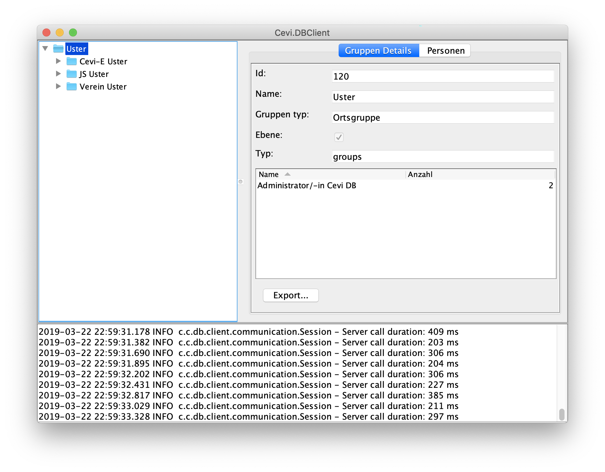

# Cevi.DB Client
## Einführung

Cevi.DB Client bietet Zugriff auf die Mitgliederdatenbank des Cevi Schweiz . Es ermöglicht konfigurierbare Exporte in CSV- und XLS-Dateien.

## Lizenz
Cevi.DB Client steht unter der [MIT Lizenz](License.md)